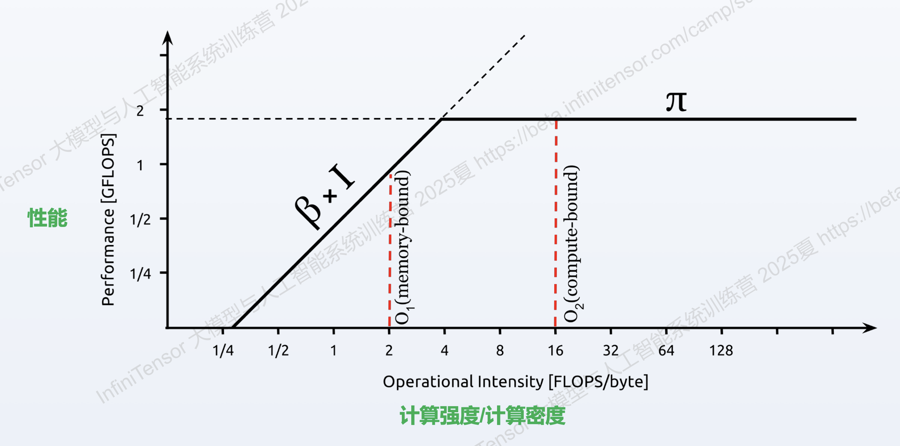

# 01_并行计算与CUDA入门
## 区别
- CPU并行：单体已具备强实力，处理复杂计算与逻辑处理，高同步
- GPU并行：单体较弱，大规模数据的简单并行计算，高吞吐
## CUDA编程
- C/C++语法、SIMT（一指令，多线程执行）、CPU协作、自动调度
## GPU单元
- CUDA Core/SP：负责通用计算
## 运算过程
1. CPU准备数据，存储在RAM主存；
2. 通过Bus/总线传输给Global Memory（GPU）
3. GPU从GM读数据，运算，并写回；
4. 总线传输回CPU
## 线程编号
SIMT指挥每个线程，需要组织结构和编号：idx = BlockId * BlockSize + ThreadId
- Grid -> Block -> Thread
grid、block可以有三维，设置grid具备的block个数时，采用` 运算总数 / 线程数 ` 上取整，同时核心函数需要有越界判断。
## 瓶颈
### 性能分析：`nsys`(Nsight Systems):
- 启动profiling: `nsys profile -t cuda,nvtx,osrt -o add_cuda -f true ./add_cuda`
- 解析并统计性能信息：`nsys stats add_cuda.nsys-rep`
1. 核函数唤醒(可修改实现解决)
2. 通过总线进行写入与写回的开销

# 02_性能模型与逐元素优化
## 问题分析 
- 基础问题：HtoD 和 DtoH 的耗时远大于核函数时间
- 实际情况：在最新GPU上，对于`FP32`的`运算速度`，远超`数据传输速度(带宽)`。
- 内存墙：
基于摩尔定律，算力增速远超DRAM，而冯诺伊曼架构（指令也是文件）下，数据在处理器与内存间反复传输。

**结论**：处理器（cpu/gpu）`计算速度`远快于`内存访问速度`。

## Roofline模型
快速评估算子在某个硬件的性能瓶颈，是量化性能瓶颈的方法。

- X轴：算子`算术强度`(Arithmetic Intensity, AI)，单位：FLOP/Byte
- Y轴：算子`性能`，单位：FLOP/s
- 斜线：`带宽上限`，单位：FLOP/s
- 横线：`计算上限`，单位：FLOP/s
- 拐点/脊点：可达理论最高性能的最低计算强度
    - 脊点以左：`访存密集型`，瓶颈在访存**占绝大多数**
    - 脊点以右：`计算密集型`，瓶颈在计算
## 优化策略
### 分析工具：Nsight Compute
- ncu CLI: `sudo ${ncu} --nvtx --call-stack --set full ./add_cuda`
- ncu GUI：`sudo ${ncu} --nvtx --call-stack --set full -f --export add_cuda.ncu-rep ./add_cuda`

### 优化方法
$$ AI = W / Q $$
1. 提升访存效率：
    - 合并内存访问(向量化访问)：本质SIMD（单指令多数据）
        - 存在提升上限：增加寄存器使用数，寄存器溢出后会增加访问延时
    - 内存对齐：
        DRAM以`内存事务`为单位进行数据传输，通常为32、64、128字节，若访问不对齐，则会引发多次内存事务，降低带宽利用率。
    - 内存合并：
        CUDA以线程束(warp)为单位进行内存访问，若warp内线程访问的地址不连续或不能很好对齐，则会引发多次内存事务，降低带宽利用率。
    - 半精度计算：降低计算精度，减少传输的数据量
2. 减少访存压力(Q⬇️)：
    - 半精度
3. 增加计算量(W⬆️)：
    - 算子融合
